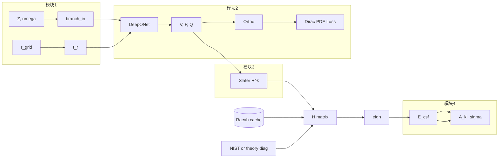

# 01 — 端到端架构（四模块管线）

> 把一个 batch 从 dataloader 到能级、跃迁率、截面的全过程。形状 `[...]`；可微节点标注 `∇✓` / `∇✗`。

## 1. 张量形状约定

```text
B         = batch_size
N_orb     = max_orb（如 16）
N_grid    = grid.n_grid（如 256）
N_csf     = max_csf（如 32）— 同 parent 下 CSF 数 M
N_E       = n_energy（碰撞/光电子能量网格，如 64）
D_branch  = branch 输出维（如 128）
```

- `kappa[B, N_orb]`：相对论 $\kappa$，非自旋轨道编号 $j$。
- `omega[B, N_orb]`：分数占据 $\omega_{n\kappa}$（归一化到 $\sum \omega = N_\mathrm{ele}$）。
- 原子单位：$\hbar=m_e=e=1$，$c=1/\alpha$。

## 2. Batch 字典（`AtomicBatch`）

```python
batch = {
    "Z": int32[B],
    "ion_charge": int32[B],
    "nele": int32[B],
    "parent_config_id": int32[B],      # 组态哈希
    "level_config_id": int32[B],      # 可选，行级样本
    "shell_table": int32[B, N_orb, 4],  # n, l, twice_j, occ_num
    "orb_mask": bool[B, N_orb],
    "kappa": int32[B, N_orb],
    "omega": float32[B, N_orb],       # 分数占据
    "csf_index": int32[B, N_csf],     # CSF 槽位
    "csf_mask": bool[B, N_csf],
    "J": float32[B, N_csf],
    "parity": int32[B, N_csf],
    "E_nist": float32[B, N_csf],      # Hartree，相对基态；无数据处 NaN（不使用）
    "nist_mask": bool[B, N_csf],      # True=NIST 有收录；False=走理论回退
    # H_diag_theory 由 forward 从 E_orb + Slater 装配得到，不必入 batch
}
```

## 3. 模块 1 — 坐标映射 `∇✗`（对 $c_1,c_2$ 可选 ∇✓）

```text
r_grid [N_grid]
t = c1 * sqrt(r) + c2 * log(r + r_eps)                    # [N_grid]
branch_in = concat(embed(Z), omega_masked, shell_stats)     # [B, D_in]
```

输出：`t_grid`, `branch_features`（供模块 2 branch）。

详见 `02_coordinate_mapping.md`。

## 4. 模块 2 — 神经 Dirac 求解器 `∇✓`

```text
# DeepONet
b = BranchNet(branch_in)                                    # [B, D_branch]
V, P, Q = TrunkNet(b, t_grid, kappa, orb_mask)              # V:[B,N_grid], P,Q:[B,N_orb,N_grid]

# 正交（Löwdin 或 Gram-Schmidt，在 r 上积分度量）
P, Q = orthonormalize(P, Q, grid, orb_mask)

# Dirac 残差
LP, LQ = DiracOperator(P, Q, dP, dQ, V, kappa, r_grid)
L_pde = mean( || LP - E_orb * P ||^2 + || LQ - E_orb * Q ||^2 )
```

**束缚态**：trunk 直接输出 $P,Q$。  
**连续态**（可选子模块）：`PhaseAmplitudeHead` → $A(r), \phi(r)$，再合成散射旋量。

详见 `03_neural_dirac_solver.md`。

## 5. 模块 3 — 可微 CI（NIST + Fall-back）`∇✓`（角向 `∇✗`）

```text
# 离线角向系数（stop_gradient）
C_ang = racah_cache.lookup(parent_config_id, csf_pair)      # [B, N_csf, N_csf, n_k]

# 在线径向 Slater 积分
R_k = slater_radial_integrals(P, Q, grid, k_list)         # [B, n_k, N_orb, N_orb, ...]

# 组装 H_ij
H = assemble_hamiltonian(E_orb, R_k, C_ang, csf_mask)     # [B, N_csf, N_csf]

# 对角混合填充：NIST 有则注入，无则 Fall-back 到理论对角元（仅改对角）
H = fill_h_diagonal_hybrid(
    H, E_nist, H_diag_theory, nist_mask,
)  # H_ii <- where(mask, E_nist, H_ii^theory)

# 对称化 + 破缺
H_reg = symmetrize(H) + eps_degen * I

E_csf, V_csf = differentiable_eigh(H_reg)                 # [B,N_csf], [B,N_csf,N_csf]
```

详见 `04_differentiable_ci.md`、`14_degenerate_gradient_safety.md`。

## 6. 模块 4 — 可观测量 `∇✓`

```text
# 电偶极 / 磁偶极等多极
A_ki, gf = transition_rates(V_csf, P, Q, multipole="E1")

# 碰撞：因子化 + 对数能量样条
sigma_CE = collision_cross_section(V_csf, P, Q, E_grid=N_E)  # [B, N_trans, N_E]
```

推断路径默认 **`@jax.jit`** 包装模块 2→3→4；训练时模块 1 常量。

详见 `05_observables_inference.md`。

## 7. 前向输出字典

```python
{
    "t_grid": ...,
    "V": ...,                      # [B, N_grid]
    "wavefunctions": {"P", "Q", "dPdr", "dQdr"},
    "E_orb": ...,                  # [B, N_orb]
    "E_csf": ...,                  # [B, N_csf]
    "V_csf": ...,                  # [B, N_csf, N_csf]
    "H": ...,                      # 正则化后
    "transitions": {"A_ki", "gf", "wavelength_nm"},
    "cross_sections": {"CE", "CI", "PI", "RR"},  # 可选
    "loss_terms": {...},           # 训练态
}
```

## 8. 与 V2 数据流对比

```text
V2:  encoder → KAN(λ,c) → envelope×B-spline → Löwdin → Dirac → E_orb_sum
V3:  coord_map → DeepONet → V,P,Q 统一势场 → Löwdin → Dirac → Slater+CI → E_csf → observables
```

V3 **不再**使用 `E_orb_sum` 作为主能量；主能量为 **`E_csf` 本征值**。`E_orb` 仅作单粒子对角参考与 PDE 监督。

## 9. `jit` / `vmap` 切分建议

| 子图 | `jit` | `vmap` 轴 |
|------|-------|-----------|
| `coord_map` | 是 | — |
| `neural_dirac` | 是 | — |
| `slater_integrals` | 是 | — |
| `eigh` | 是（小 $M$） | 避免对 $M$ vmap |
| `cross_sections` | 是 | `E` 轴 `vmap` |
| 训练 step | `jax.jit(train_step)` | batch 由 `pmap` 或 scan |

## 10. Mermaid 总览


